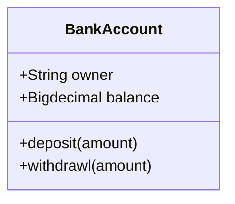

README 
--------------

# Informe de la aplicación
# Proyecto UPOCASA

# Tabla de contenidos
1. [Integrantes](#integrantes)
2. [Por hacer](#por-hacer)
3. [Base de datos](#base-de-datos)
4. [Tecnologías y Herramientas](#tecnologías-y-herramientas)


## Integrantes

Los integrantes de este proyecto son:
* Alejandro Palomino García
* Iván Alfonso Rodríguez Ruiz


## Por hacer

* (documentación)             -> (Iván/Alex) Análisis, Especificación, Diseño, Implementación, Pruebas y despliegue
* (documentación-manual)      -> (Iván/Alex) Manual de uso de la aplicación  

* (Nuevo! messages.php)       -> (Alex) Mensajeria entre usuarios
* (Nuevo! ads.php)            -> (Iván) Gestión de anuncios propios del usuario


## Base de datos

* La base de datos se llamará upocasa

```sql
DROP SCHEMA IF EXISTS `upocasa` ;
CREATE SCHEMA IF NOT EXISTS `upocasa` 
DEFAULT CHARACTER SET utf8mb4 
DEFAULT COLLATE 'utf8mb4_spanish_ci';
USE `upocasa` ;
```

### Entidades

* usuarios

```sql
DROP TABLE IF EXISTS `upocasa`.`usuarios` ;

CREATE TABLE IF NOT EXISTS `upocasa`.`usuarios` (
  `idUsuario` INT NOT NULL AUTO_INCREMENT,
  `nombre` VARCHAR(60) NOT NULL,
  `correo` VARCHAR(60) NOT NULL,
  `clave` VARCHAR(120) NOT NULL,
  `alta` TIMESTAMP NOT NULL DEFAULT CURRENT_TIMESTAMP,
  PRIMARY KEY (`idUsuario`),
  UNIQUE INDEX `correo_UNIQUE` (`correo` ASC),
  UNIQUE INDEX `nombre_UNIQUE` (`nombre` ASC),
  UNIQUE INDEX `idUsuario_UNIQUE` (`idUsuario` ASC))
ENGINE = InnoDB
DEFAULT CHARACTER SET = utf8mb4;
```
* Municipios

```sql
DROP TABLE IF EXISTS `upocasa`.`municipios` ;

CREATE TABLE municipios (
  codPostal INT NOT NULL,
  nombreMunicipio VARCHAR(255) NOT NULL)
ENGINE = InnoDB
DEFAULT CHARACTER SET = utf8mb4
COMMENT = 'Municipios\n';
```

* Tipos de anuncio

```sql
DROP TABLE IF EXISTS `upocasa`.`tiposAnuncio` ;

CREATE TABLE IF NOT EXISTS `upocasa`.`tiposAnuncio` (
  `idTipoAnuncio` INT NOT NULL AUTO_INCREMENT,
  `tipoAnuncio` VARCHAR(45) NOT NULL,
  PRIMARY KEY (`idTipoAnuncio`),
  UNIQUE INDEX `tipo_UNIQUE` (`tipoAnuncio` ASC))
ENGINE = InnoDB
DEFAULT CHARACTER SET = utf8mb4
COMMENT = 'Tipos de Anuncio\n';
```


* Tipos de vivienda

```sql
DROP TABLE IF EXISTS `upocasa`.`tiposVivienda` ;

CREATE TABLE IF NOT EXISTS `upocasa`.`tiposVivienda` (
  `idtipoVivienda` INT NOT NULL AUTO_INCREMENT,
  `tipoVivienda` VARCHAR(45) NOT NULL,
  PRIMARY KEY (`idtipoVivienda`),
  UNIQUE INDEX `tipoVivienda_UNIQUE` (`tipoVivienda` ASC))
ENGINE = InnoDB
DEFAULT CHARACTER SET = utf8mb4
COMMENT = 'Tipos de Vivienda';
```

* Anuncios

```sql
DROP TABLE IF EXISTS `upocasa`.`anuncios` ;

CREATE TABLE IF NOT EXISTS `upocasa`.`anuncios` (
  `idAnuncio` INT NOT NULL AUTO_INCREMENT,
  `idUsuario` INT NOT NULL,
  `idTipoAnuncio` INT NOT NULL,
  `idTipoVivienda` VARCHAR(45) NOT NULL,
  `precio` DECIMAL NOT NULL,
  `superficie` DECIMAL NOT NULL,
  `direccion` VARCHAR(120) NOT NULL,
  `codPostal` TINYINT(5) NOT NULL,
  `numHabitaciones` TINYINT(2) NULL,
  `numAseos` TINYINT(2) NULL,
  `consumo` CHAR(1) NULL,
  `emisiones` CHAR(1) NULL,
  `comentarios` VARCHAR(450) NOT NULL,
  PRIMARY KEY (`idAnuncio`),
  UNIQUE INDEX `idAnuncio_UNIQUE` (`idAnuncio` ASC),
  INDEX `fk_anuncios_usuarios_idx` (`idUsuario` ASC),
  INDEX `fk_anuncios_tiposAnuncio_idx` (`idTipoAnuncio` ASC),
  INDEX `fk_anuncios_tiposVivienda_idx` (`idTipoVivienda` ASC),
  CONSTRAINT `fk_anuncios_usuarios`
    FOREIGN KEY (`idUsuario`)
    REFERENCES `upocasa`.`usuarios` (`idUsuario`)
    ON DELETE NO ACTION
    ON UPDATE NO ACTION,
  CONSTRAINT `fk_anuncios_tiposAnuncio`
    FOREIGN KEY (`idTipoAnuncio`)
    REFERENCES `upocasa`.`tiposAnuncio` (`idTipoAnuncio`)
    ON DELETE NO ACTION
    ON UPDATE NO ACTION,
  CONSTRAINT `fk_anuncios_tiposVivienda`
    FOREIGN KEY (`idTipoVivienda`)
    REFERENCES `upocasa`.`tiposVivienda` (`tipoVivienda`)
    ON DELETE NO ACTION
    ON UPDATE NO ACTION)
ENGINE = InnoDB
DEFAULT CHARACTER SET = utf8mb4
COMMENT = 'Anuncios por usuario [∞ ← 1]\n';
```

* Fotos

```sql
DROP TABLE IF EXISTS `upocasa`.`fotos` ;

CREATE TABLE IF NOT EXISTS `upocasa`.`fotos` (
  `idFoto` INT NOT NULL AUTO_INCREMENT,
  `idAnuncio` INT NULL,
  `urlFoto1` VARCHAR(45) NULL,
  `urlFoto2` VARCHAR(45) NULL,
  `urlFoto3` VARCHAR(45) NULL,
  `urlFoto4` VARCHAR(45) NULL,
  `urlFoto5` VARCHAR(45) NULL,
  INDEX `fk_fotos_anuncios_idx` (`idAnuncio` ASC),
  PRIMARY KEY (`idFoto`),
  CONSTRAINT `fk_fotos_anuncios`
    FOREIGN KEY (`idAnuncio`)
    REFERENCES `upocasa`.`anuncios` (`idAnuncio`)
    ON DELETE NO ACTION
    ON UPDATE NO ACTION)
ENGINE = InnoDB
DEFAULT CHARACTER SET = utf8mb4;
```

* Mensajes

```sql
DROP TABLE IF EXISTS `upocasa`.`mensajes` ;

CREATE TABLE IF NOT EXISTS `upocasa`.`mensajes` (
  `idMensajes` INT NOT NULL AUTO_INCREMENT,
  `idUsuOrigen` INT NOT NULL,
  `idUsuDestino` INT NOT NULL,
  `mensaje` VARCHAR(450) NOT NULL,
  `fechaEnvio` TIMESTAMP NOT NULL DEFAULT CURRENT_TIMESTAMP,
  PRIMARY KEY (`idMensajes`),
  INDEX `fk_mensajes_usuarios_idx` (`idUsuOrigen` ASC),
  INDEX `fk_mensajes_usuarios2_idx` (`idUsuDestino` ASC),
  CONSTRAINT `fk_mensajes_usuarios1`
    FOREIGN KEY (`idUsuOrigen`)
    REFERENCES `upocasa`.`usuarios` (`idUsuario`)
    ON DELETE NO ACTION
    ON UPDATE NO ACTION,
  CONSTRAINT `fk_mensajes_usuarios2`
    FOREIGN KEY (`idUsuDestino`)
    REFERENCES `upocasa`.`usuarios` (`idUsuario`)
    ON DELETE NO ACTION
    ON UPDATE NO ACTION)
ENGINE = InnoDB
DEFAULT CHARACTER SET = utf8mb4;
```

* Extras

```sql
DROP TABLE IF EXISTS `upocasa`.`extras` ;

CREATE TABLE IF NOT EXISTS `upocasa`.`extras` (
  `idExtra` INT NOT NULL AUTO_INCREMENT,
  `extra` VARCHAR(45) NOT NULL,
  PRIMARY KEY (`idExtra`))
ENGINE = InnoDB
DEFAULT CHARACTER SET = utf8mb4;
```

* Anuncios-Extras

```sql
DROP TABLE IF EXISTS `upocasa`.`anuncios_extras` ;

CREATE TABLE IF NOT EXISTS `upocasa`.`anuncios_extras` (
  `idAnuncio` INT NOT NULL,
  `idExtra` INT NOT NULL,
  PRIMARY KEY (`idAnuncio`, `idExtra`),
  INDEX `fk_anuncios_extras_extras_idx` (`idExtra` ASC),
  CONSTRAINT `fk_anuncios_extras_anuncios`
    FOREIGN KEY (`idAnuncio`)
    REFERENCES `upocasa`.`anuncios` (`idAnuncio`)
    ON DELETE NO ACTION
    ON UPDATE NO ACTION,
  CONSTRAINT `fk_anuncios_extras_extras`
    FOREIGN KEY (`idExtra`)
    REFERENCES `upocasa`.`extras` (`idExtra`)
    ON DELETE NO ACTION
    ON UPDATE NO ACTION)
ENGINE = InnoDB
DEFAULT CHARACTER SET = utf8mb4;
```


* (Inserciones)

```sql
INSERT INTO `tiposAnuncio` (`idTipoAnuncio`, `tipoAnuncio`) 
VALUES
(1, 'Vendo'),
(2, 'Alquilo'),
(3, 'Comparto'),
(4, 'Vacacional');

INSERT INTO `tiposVivienda` (`idtipoVivienda`, `tipoVivienda`) 
VALUES
(1, 'Vivienda'),
(2, 'Garaje'),
(3, 'Terreno'),
(4, 'Local Comercial'),
(5, 'Oficina'),
(6, 'Trastero');


INSERT INTO `extras` (`idExtra`, `extra`) VALUES
(1, 'Garaje Privado'),
(2, 'Trastero'),
(3, 'Ascensor'),
(4, 'Parking Comunitario'),
(5, 'Servicio de Portería'),
(6, 'Videoportero'),
(7, 'Aire acondicionado'),
(8, 'Armarios'),
(9, 'Calefacción'),
(10, 'Parquet'),
(11, 'Cocina Office'),
(12, 'Suite con baño'),
(13, 'Amueblado'),
(14, 'Electrodomésticos'),
(15, 'Horno'),
(16, 'Lavadora'),
(17, 'Microondas'),
(18, 'Nevera'),
(19, 'TV'),
(20, 'Internet'),
(21, 'Puerta Blindada'),
(22, 'Lavadero'),
(23, 'No Amueblado'),
(24, 'Jardín Privado'),
(25, 'Terraza'),
(26, 'Zona Comunitaria'),
(27, 'Patio'),
(28, 'Piscina'),
(29, 'Balcón'),
(30, 'Zona Deportiva'),
(31, 'Zona Infantil'),
(32, 'Piscina Comunitaria');

-- Usuarios
INSERT INTO `usuarios` 
(`idUsuario`, `nombre`, `nick`, `correo`, `clave`, `alta`) 
VALUES
(1, 'Alejandro', 'alex', 'alejandrodh570@gmail.com', '$2y$10$MyxsqyP/3QIwrDbQcY5Y4erf36G0d/0ki9y4cOlRhFKsNZVlEg/W6', '2019-12-30 17:56:27'),
(2, 'Iván', 'ivan', 'ivanrguez1@yahoo.es', '$2y$10$WemNiU3zyP1qY.lN8VOVeOy9Xrsv6aYHXaFfb69xC5w7rjqvriUeK', '2019-12-30 17:57:13'),
(3, 'admin', 'admin', 'admin@upocasa.es', '$2y$10$bngm/n1jixoY.ElRKX6onu5/cNxf7tb6gJLe3QrQLGgTdbXzxPDhG', '2020-01-28 14:15:45'),;

## Tecnologías y Herramientas

* Front-End
  * HTML 5 & CSS3
  * JavaScript (ECMAScript 6)
  * Jquery 3
  * BootStrap 4

* Back-End
  * MySQL Server 5.7
  * MySQL Workbench 6.3
  * PHP 7
  * PhpMyAdmin 4.9

* Otros
  * PhpStorm 2019.3
  * Visual Studio Code 1.40
  * Markdown


## Diagramas




